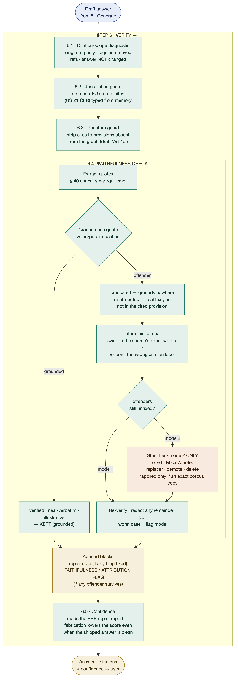

# The Faithfulness Check (Step 6 · Verify)

This document explains **Step 6 — Verify**, the deterministic self-check every
CRSS answer passes through between generation and the user. It is a runtime stage
in the online read path (`application/agent.ask_stream` → `application/verify.py`),
not an offline evaluation tool: the guards described here run on *every* answer
served, and users rely on them.

Its job is narrow and non-negotiable for a compliance product: **an answer must
never present a fabricated, displaced, or nonexistent legal citation as if it
were grounded in the actual regulation.** The whole value proposition of CRSS is
"grounded in the real legal text," and this stage is what makes that a guarantee
rather than a hope.

---

## The pipeline



*Rendered diagram (displays in MacDown, GitHub, and any Markdown viewer). Editable
source: [`assets/faithfulness_check.mmd`](assets/faithfulness_check.mmd). To
regenerate the PNG after editing the source, run from the repo root:*

```bash
npx -y @mermaid-js/mermaid-cli@11 -i docs/assets/faithfulness_check.mmd \
  -o docs/assets/faithfulness_check.png -b white -s 3 -p docs/assets/.puppeteer.json
```

Colour legend (matching the system architecture diagram): **green = deterministic**,
**orange = LLM call**, **gold = curated / user-facing surface**, **blue = data**.
Note that the single orange node fires in strict mode only — see
[Modes](#modes-and-the-deterministic-colour-caveat).

---

## Why the order is fixed

The five sub-stages run in a fixed sequence because they operate on different
surfaces of the answer and must not step on each other:

1. The three **citation guards (6.1–6.3)** run first because they work on
   *citations and prose* — text the quote checker never inspects. A phantom
   citation, for example, is usually quote-free, so if the faithfulness check ran
   first it would pass the phantom straight through.
2. The **faithfulness check (6.4)** runs on *verbatim quotes* after the citation
   surface is clean.
3. **Confidence (6.5)** runs last because it scores the whole outcome — but,
   critically, it reads the report computed *before* any repair (see 6.5).

Each guard is independently switchable by an environment variable, but the order
never changes.

---

## Step by step — what each does, and why it is necessary

### 6.1 · Citation-scope diagnostic

**What:** When both the question and the answer resolve to a *single* regulation,
detect Article/Annex/Recital references the answer cites that were never in the
retrieved context, and **log** them. It does **not** alter the answer.
(`_apply_citation_scope_note`, `CRSS_CITATION_SCOPE_CHECK`.)

**Why it is necessary:** It is an early-warning signal that the model is reaching
for authority it wasn't given — often a symptom of a retrieval gap. It is
*log-only* by deliberate design: the quality eval showed that most out-of-scope
refs are legitimate cross-references the model cites *without quoting* (so no
faithfulness issue exists), and a loud user-facing banner read to reviewers as a
blanket "this answer is unreliable" disclaimer rather than an actionable finding.
So the detection is kept as an operational diagnostic; the actual enforcement of
citation integrity happens in 6.2–6.4.

### 6.2 · Jurisdiction guard

**What:** Strip citations to non-EU statutory law (the recurring offender is US
`21 CFR`) that the model types from training memory.
(`_strip_foreign_law_citations`, `CRSS_JURISDICTION_GUARD`.)

**Why it is necessary:** On a cross-jurisdiction question ("how does this compare
to FDA rules?"), the model will confidently assert US obligations as though they
were part of the EU analysis. For a compliance officer, acting on a fabricated
foreign duty is a real liability event. A prompt-level instruction alone did not
hold under direct user pressure — an answer was observed carrying nine separate
`21 CFR` citations with the rule active — so the guarantee is enforced
deterministically here rather than left to the model's discretion.

### 6.3 · Phantom-provision guard

**What:** Existence-check every Article/Annex/Recital mention against the whole
knowledge graph and strip citations to provisions that do not exist in the cited
regulation. (`strip_phantom_citations`, `CRSS_PHANTOM_GUARD`.)

**Why it is necessary:** The AI Act was **renumbered between the draft and final
texts**. Models trained across that transition confidently cite the *draft*
scheme — `Title IA`, `Articles 4a–4c` — which simply does not exist in the
Regulation as enacted. Citing a nonexistent provision is a fabrication of legal
authority, and it is invisible to the quote checker: a quote-free prose paragraph
("under Article 4b, providers must…") passes faithfulness trivially. This guard is
the only thing that catches it, by checking the *reference itself* against the
graph rather than checking quoted text.

### 6.4 · Faithfulness check — the core

This is the heart of Step 6. It verifies that **every verbatim quotation** in the
answer actually appears in the retrieved legal text, and repairs or removes those
that do not. (`check_faithfulness`, `repair_and_redact`,
`application/_faithfulness_repair.py`; `CRSS_FAITHFULNESS_CHECK`,
`CRSS_QUOTE_REPAIR`, `CRSS_REPAIR_MODEL`.)

**Extract.** Pull out every quotation of 40 characters or more (straight, smart,
and guillemet quotes, including those inside markdown emphasis). Short fragments
are ignored — they are almost always ordinary phrasing, not quotation claims.

**Classify.** Ground each quote against the full retrieved corpus (provisions +
definitions + guidance) and sort it into exactly one of five buckets:

| Bucket | Meaning | Outcome |
|---|---|---|
| **verified** | exact substring of the corpus, or an echo of the user's own question | kept |
| **near-verbatim** | grounded, minor wording drift | kept, with a light "verify wording" note |
| **illustrative** | the model's own drafted wording (a template, an embellished scenario detail), not a claim about legal text | kept |
| **fabricated** | cannot be grounded anywhere in the corpus | offender → repaired or removed |
| **misattributed** | real regulatory text, but concatenated across provisions or displaced from the provision its citation claims | offender → repaired or removed |

**Why classification is necessary:** the failure modes are genuinely different and
must not be treated alike. A trivial reworded quote is not a fabrication; the
model restating the user's scenario in quote marks is not a legal claim; and real
text under the wrong citation ("misattribution") is a distinct problem from text
that exists nowhere ("fabrication"). Collapsing these would either over-redact
sound answers or under-catch real defects.

**Deterministic repair.** Verification has already located what most offenders
need, so the answer is *corrected* rather than gutted (`repair_and_redact`):

- a fabricated quote that *paraphrases* its own cited provision is replaced with
  that provision's exact sentence run (match ratio ≥ 0.60);
- a misattributed quote has its citation label **re-pointed** to the provision
  that actually contains the text;
- a near-verbatim quote is tightened to the source's exact wording (ratio ≥ 0.80).

**Why repair, not just redaction:** early versions simply deleted every offending
quote, which left holes and warning banners in otherwise-correct answers — and
in the misattribution/near-verbatim cases the text *was* real and grounded, just
mislabelled. Deterministic repair turns "a hole plus a warning" back into a
correct, grounded answer, without any model call.

**Strict tier — `CRSS_FAITHFULNESS_CHECK=2` only** (`_faithfulness_repair.py`).
Some offenders defeat string matching: the model's own *analysis* wrapped in quote
marks (grounds nowhere because it is not anyone's legal text), or a plausible
quotation typed from memory with no retrieved source behind it. In strict mode,
each residual offender (up to four per answer) gets **one narrowly-scoped LLM
decision**:

- **replace** — copy the correct wording from a supplied source excerpt, **applied
  only if the returned text verifies as an exact substring of the retrieved
  corpus** (a hallucinated "fix" is rejected outright);
- **demote** — strip the quotation marks; the span was the answer's own prose
  wrongly presented as a quote. The inner text is kept byte-for-byte;
- **delete** — replace with the redaction marker; it claims legal wording no
  source supports.

**Why the strict tier exists and why it is safe:** it is the direct treatment for
the residual fabrication/misattribution cases that recurred across evaluation
runs and could not be fixed deterministically. It is safe because **the model
never authors free text into the answer** — `replace` is gated on exact-substring
verification, `demote`/`delete` are pure string surgery on existing text, and any
failure (bad output, API error, rejected replacement) leaves the quote in place
for the final redaction pass. See [Modes](#modes-and-the-deterministic-colour-caveat).

**Re-verify and redact remainder.** After repair, the answer is checked once more;
anything still failing is hard-redacted with a `[…]` marker — exactly what flag
mode (mode 1) would have done. This is the guarantee that repair can only ever
*improve* on redaction, never worsen it.

### 6.5 · Confidence

**What:** Compute the five-component composite confidence score, and crucially
read the **pre-repair** faithfulness report. (`compute_confidence`.)

**Why it is necessary — and why "pre-repair" is the single most important decision
in this stage:** repair makes the *shipped* answer clean, but the underlying model
may still be fabricating. If confidence read the *post-repair* answer, the score
would be a meaningless constant — every offending quote is already gone — and,
worse, runtime repair would silently mask a degrading generator. By scoring the
report as it stood *before* repair, generation-time misbehaviour still lowers the
confidence even when the delivered text is spotless. Repair hides the defect from
the reader; it must never hide it from the metric.

---

## The safety invariant

Across the whole stage, the repair tiers can only **subtract or verify — never
invent**:

- a deterministic substitution must be the source's exact sentence run;
- an LLM `replace` is discarded unless it is an exact substring of the retrieved
  corpus;
- `demote` keeps the answer's own words byte-for-byte and only removes quote marks;
- every failure path falls through to the same hard redaction that flag mode uses.

**Therefore the worst case of any repair is byte-identical to plain redaction.**
This is what makes it defensible to run in the production read path: the machinery
can only make an answer more faithful, never less.

---

## Modes and the deterministic-colour caveat

`CRSS_FAITHFULNESS_CHECK` selects the behaviour:

| Mode | Behaviour | Character of Step 6 |
|---|---|---|
| `0` | off — no verification | (not recommended for a compliance tool) |
| `1` | **default** — flag + deterministic repair; unrepairable offenders redacted | fully deterministic |
| `2` | strict — adds the LLM repair tier for the residuals mode 1 cannot fix | contains one LLM call |

In the system architecture diagram, the `Verify` node is coloured **deterministic
(green)** — which is correct for the **production default (mode 1)**. The strict
tier (mode 2) introduces an LLM call *inside* this stage, so under mode 2 the
`Verify` node is no longer purely deterministic. The current recommendation is
therefore **strict-tier on for evaluation, off for production** until the added
read-path latency and cost are explicitly budgeted — keeping the production
default a clean deterministic guard.

---

## Environment reference

| Variable | Default | Controls |
|---|---|---|
| `CRSS_FAITHFULNESS_CHECK` | `1` | `0` off · `1` flag + deterministic repair · `2` strict + LLM repair |
| `CRSS_QUOTE_REPAIR` | `1` | `0` skips all repair — straight to hard redaction (both modes) |
| `CRSS_REPAIR_MODEL` | `mistral-medium-latest` | model used for the mode-2 LLM adjudication call |
| `CRSS_JURISDICTION_GUARD` | `1` | strip non-EU statutory citations (6.2) |
| `CRSS_PHANTOM_GUARD` | `1` | strip citations to provisions absent from the graph (6.3) |
| `CRSS_CITATION_SCOPE_CHECK` | `1` | log (not render) out-of-scope refs on single-reg questions (6.1) |

---

## Source map

| Concern | Location |
|---|---|
| Stage orchestration (fixed order) | `application/verify.py` → `verify_answer()` |
| Quote extraction, grounding, classification | `application/_faithfulness.py` → `check_faithfulness()` |
| Deterministic repair + redaction | `application/_faithfulness.py` → `repair_and_redact()` |
| Strict-tier LLM repair (mode 2) | `application/_faithfulness_repair.py` → `llm_repair_residuals()` |
| Jurisdiction guard | `application/_postprocessing.py` → `_strip_foreign_law_citations()` |
| Phantom-provision guard | `application/_phantom.py` → `strip_phantom_citations()` |
| Confidence (reads pre-repair report) | `application/_confidence.py` → `compute_confidence()` |
| Read-path call site | `application/agent.py` → `ask_stream()` |